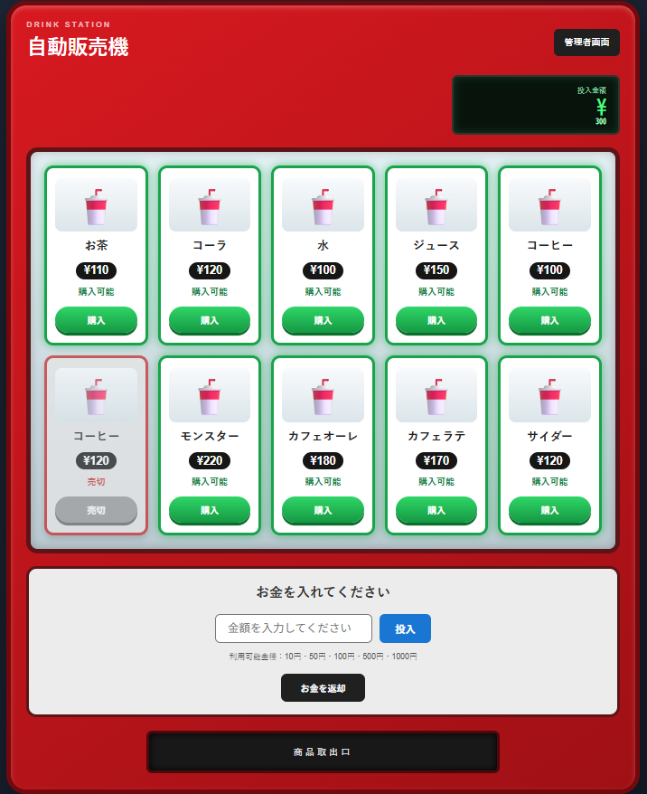
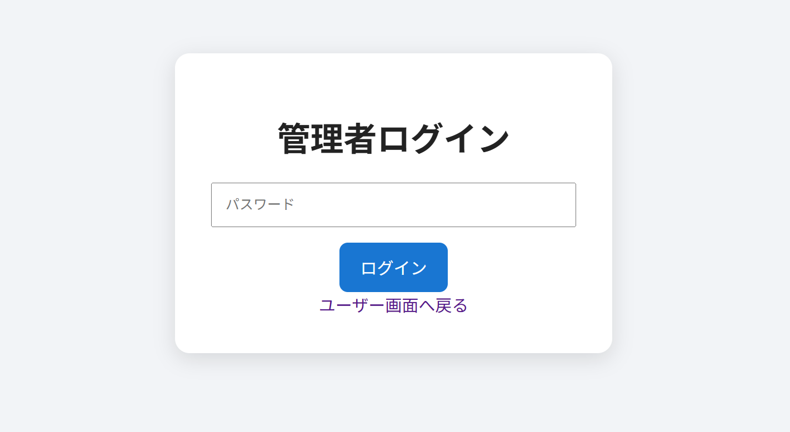
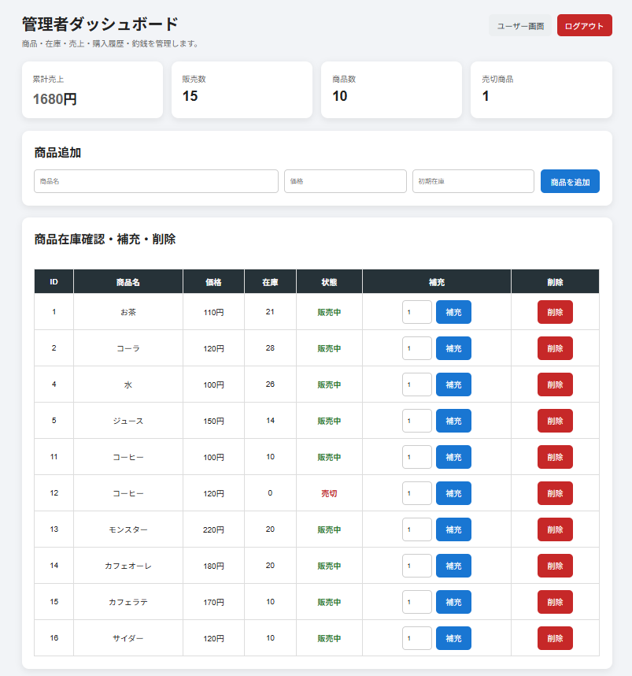

# 🥤 Vending Machine Simulator

A web-based vending machine simulator developed as a team project using **Java, Spring Boot, Thymeleaf, and MySQL**.

The system provides a realistic vending machine user interface and an admin management panel for managing products, product stock, money stock, sales, and purchase history.

---

## 🚀 Technologies Used

- ☕ Java 17
- 🚀 Spring Boot
- 🎨 Thymeleaf
- 🗄️ MySQL
- 🌐 HTML
- 🎨 CSS
- 📦 Maven
- 🔗 Spring Data JPA

---

## 📋 Features

### 👤 User Panel

Users can:

- View available products
- View product prices
- Insert money
- Purchase products
- Check the current inserted amount
- See whether a product is purchasable
- See sold-out products
- Return inserted money
- Receive change after purchasing

### Supported Denominations

- 10 yen
- 50 yen
- 100 yen
- 500 yen
- 1000 yen

Unsupported denominations are rejected by the system.

The maximum total inserted amount is **1990 yen**.

---

## 🥤 Product Purchase

Before completing a purchase, the system checks:

- Product availability
- Product stock
- Inserted money
- Product price
- Required change
- Available change stock

If the machine cannot provide the required exact change, the purchase is prevented.

After a successful purchase:

- Product stock is reduced
- Sales information is recorded
- Purchase history is recorded
- Change is calculated
- Money stock is updated

---

## 💴 Money Insertion

Users can enter supported denominations.

The system validates the inserted money and rejects unsupported denominations.

### Available

- 10 yen
- 50 yen
- 100 yen
- 500 yen
- 1000 yen

### Unavailable

- 1 yen
- 5 yen
- Other unsupported denominations

---

## 💰 Change Calculation

The vending machine automatically calculates the required change.

### Example

- Inserted money: 500 yen
- Product price: 110 yen
- Change: 390 yen

Possible change:

- 100 yen × 3
- 50 yen × 1
- 10 yen × 4

The system checks whether the available money stock can provide the exact change.

If there is not enough change available, the purchase cannot be completed.

---

## 🔐 Admin Panel

The system provides an administrator management screen.

Administrators can:

- View dashboard information
- View product stock
- Add products
- Delete products
- Replenish product stock
- Manage money stock
- Replenish coins and bills
- Enable or disable supported denominations
- View purchase history
- View sales history
- Check total sales
- Check sold-out products

---

## 📦 Product Management

Administrators can manage vending machine products.

Functions include:

- Add new products
- Delete products
- Check product stock
- Replenish product stock
- Check sold-out products

---

## 💴 Money Stock Management

Administrators can:

- Check available money stock
- Replenish money stock
- Enable denominations
- Disable denominations

The money stock is also used to determine whether the vending machine can return exact change.

---

## 📊 Sales History

The system records sales information for successful purchases.

Administrators can view:

- Sales history
- Purchase history
- Product information
- Sales amount
- Total sales

---

# 📸 Screenshots

## 👤 User Panel

The user panel provides a vending machine-style interface where users can view products, insert money, and purchase drinks.



---

## 🔐 Admin Login

Administrators can access the management system through the admin login page.



---

## 📊 Admin Dashboard

The admin dashboard provides product management, stock management, money stock management, sales information, and purchase history.



---

## 🗄️ Database

The system uses **MySQL** for data storage.

### Main Tables

- `products`
- `money_stock`
- `orders`
- `sales`

### products

Stores:

- Product ID
- Product name
- Price
- Stock

### money_stock

Stores:

- Money type
- Stock count
- Availability status

### orders

Stores purchase history.

### sales

Stores sales information.

---

## 📂 Project Structure

```text
VendingMachineWeb-1
│
├── src
│   └── main
│       ├── java
│       │   └── com.example.vendingmachine
│       │       │
│       │       ├── controller
│       │       │   └── VendingMachineController.java
│       │       │
│       │       ├── model
│       │       │   ├── Product.java
│       │       │   ├── MoneyStock.java
│       │       │   ├── Order.java
│       │       │   └── Sale.java
│       │       │
│       │       ├── repository
│       │       │   ├── ProductRepository.java
│       │       │   ├── MoneyStockRepository.java
│       │       │   ├── OrderRepository.java
│       │       │   └── SaleRepository.java
│       │       │
│       │       ├── service
│       │       │   └── VendingMachineService.java
│       │       │
│       │       └── VendingMachineWebApplication.java
│       │
│       └── resources
│           │
│           ├── templates
│           │   ├── index.html
│           │   ├── admin-login.html
│           │   └── admin.html
│           │
│           ├── static
│           │   └── css
│           │       └── style.css
│           │
│           └── application.properties
│
├── screenshots
│   ├── user-page.png
│   ├── admin-login.png
│   └── admin-dashboard.png
│
├── pom.xml
└── README.md
